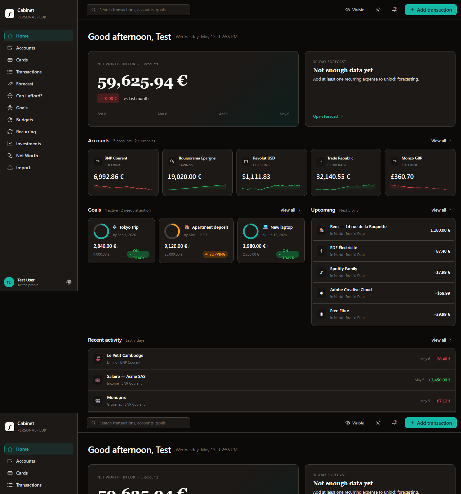
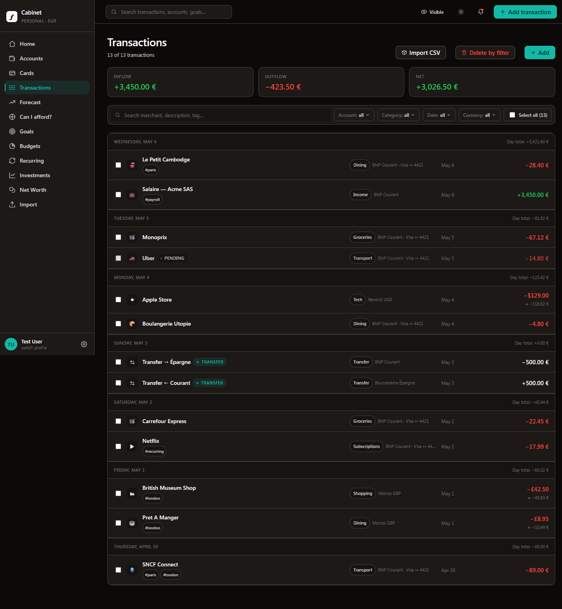
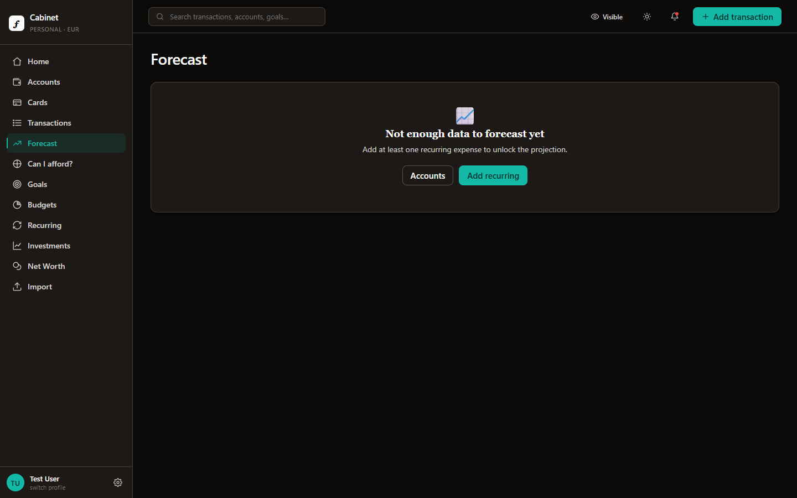
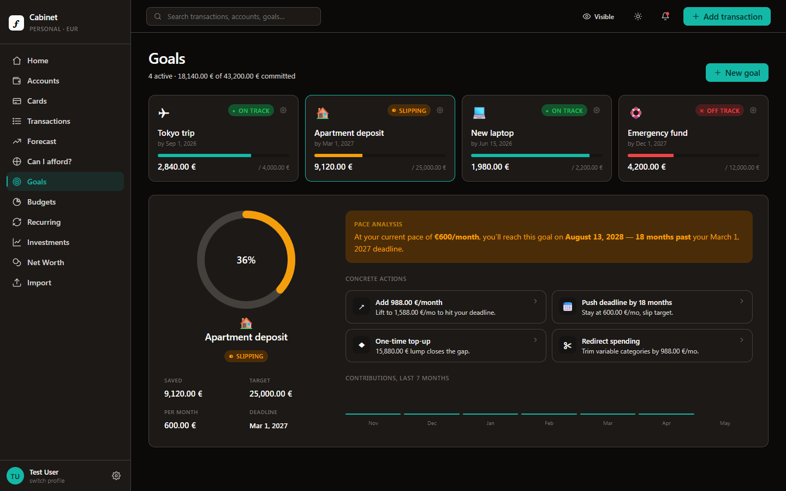
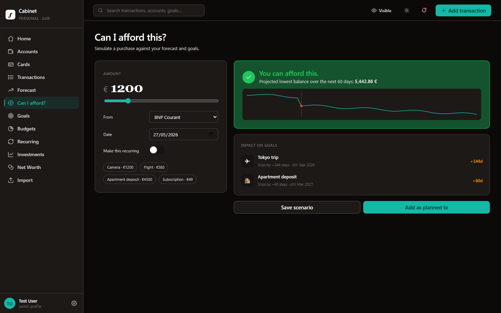
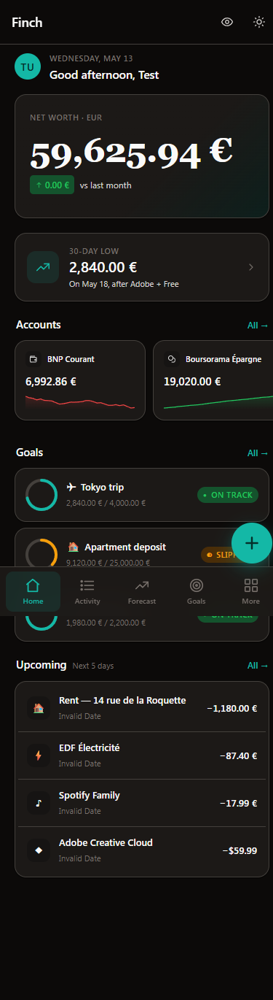
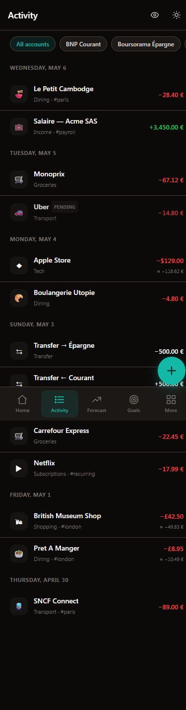
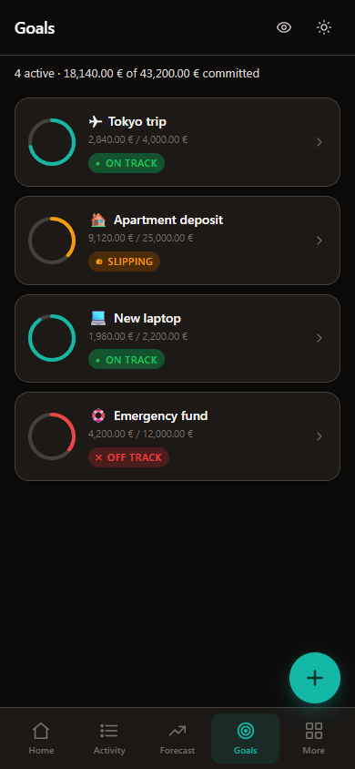
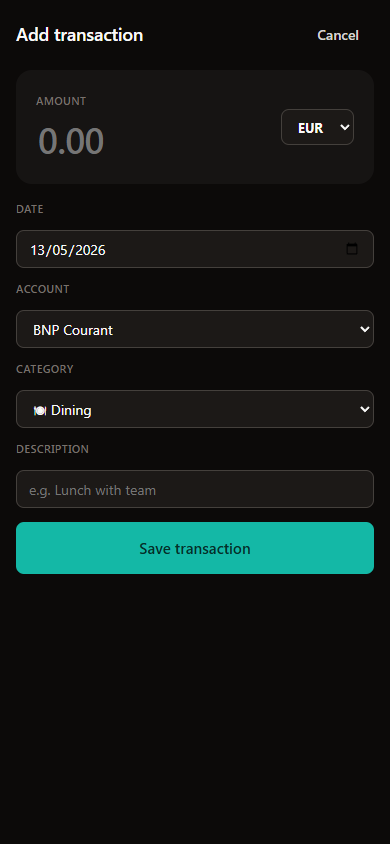

# Finch

Local-first personal finance cockpit. Multi-account, multi-currency, with
forecasting, budgets, goals, recurring rules, investments, and a privacy-blur
toggle. **No build step, no backend** — JSX is transformed in the browser via
Babel-standalone, and all data lives in `localStorage`, namespaced per profile.

<p align="center">
  
</p>

## Quick start

```bat
start.bat   :: launches the dev server on http://localhost:8765/
down.bat    :: stops whatever is listening on 8765 (production) / 8766 (demo)
```

Requirements: **Python 3** (already present on most Windows installs as `py` or
`python`). If Python is missing, `start.bat` falls back to `npx http-server`.

See [`docs/getting-started.md`](docs/getting-started.md) for the full setup,
first-launch flow, keyboard shortcuts, and reset paths.

## Two builds

Finch ships in two parallel folders that share 99% of the source:

| Build      | Folder         | Port | First-run state                          |
|------------|----------------|------|------------------------------------------|
| Production | `Finance/`     | 8765 | Empty (just 12 default categories)       |
| Demo       | `Finance-demo/`| 8766 | Auto-seeded mock (5 accounts, 13 tx, …)  |

The demo build shows a **DEMO** chip in the sidebar so you always know which one
you're in. They run side by side on different origins, so each has its own
isolated `localStorage`. See [`docs/demo-vs-production.md`](docs/demo-vs-production.md)
for the full diff and how to keep them in sync.

## Layout

```
Finance/
├── start.bat              # Single-command launcher
├── down.bat               # Stops the dev server on 8765 / 8766
├── master-spec.md         # Product source of truth
├── expense-app-plan.md    # Earlier rough plan; superseded by master-spec
├── export_UI/             # Original design mockups (read-only reference)
├── docs/                  # Developer reference — start at docs/README.md
├── tests/                 # Playwright suites
└── webapp/                # The shipped app
    ├── index.html         # Auth-aware splash that routes
    ├── auth.js            # Profile + session API (FCAuth)
    ├── store.js           # Per-profile data API (FCStore)
    ├── tokens.css         # Design tokens, light + dark, accents
    ├── components/        # Shared React components — atoms, screens, shells
    ├── desktop/           # Desktop pages + modal overrides
    ├── mobile/            # Mobile pages + bottom tab bar + FAB
    └── serve.py           # Dev server: http.server with no-cache headers
```

## Screens

### Transactions, with real working filters and bulk actions

<p align="center">
  
</p>

### Forecast — projection chart, per-account toggles, and an inline "what if I bought this?" simulator

<p align="center">
  
</p>

### Goals — progress rings, off-track flagging, and clickable suggestions that actually mutate the goal

<p align="center">
  
</p>

### "Can I afford?" simulator — verdict, goal impact, save scenarios, add as planned tx

<p align="center">
  
</p>

### Mobile — same data, real bottom-tab navigation, working full-page Add screen

<p align="center">
  
  &nbsp;
  
  &nbsp;
  
  &nbsp;
  
</p>

The full gallery — 13 desktop pages, 6 mobile pages, 4 auth/onboarding screens —
lives in [`screenshots/`](screenshots/README.md), all captured against the demo
data seed.

## Documentation

The complete developer reference lives in [`docs/`](docs/README.md):

| File | What's in it |
|---|---|
| [`docs/getting-started.md`](docs/getting-started.md) | Run the app, requirements, reset paths, keyboard shortcuts |
| [`docs/architecture.md`](docs/architecture.md) | Directory layout, runtime composition, page bootstrap |
| [`docs/auth.md`](docs/auth.md) | Profiles, login/signup/PIN, session lifecycle |
| [`docs/data-model.md`](docs/data-model.md) | The schema in `store.js`, seed behavior, cached fields |
| [`docs/components.md`](docs/components.md) | Atoms, screens, modals — what they expect |
| [`docs/adding-a-page.md`](docs/adding-a-page.md) | Recipe for landing a new desktop or mobile page |
| [`docs/testing.md`](docs/testing.md) | Playwright suites — how to run, what they cover |
| [`docs/demo-vs-production.md`](docs/demo-vs-production.md) | The two builds and how to maintain both |
| [`docs/roadmap.md`](docs/roadmap.md) | What's in v1, what's deferred, open questions |

## Tech choices, briefly

- **Why no build step?** Trades a one-time ~250 ms Babel parse for zero
  toolchain — no `npm install`, no TypeScript compile. `start.bat` works on a
  fresh Windows install with just Python. Replacing Babel-standalone with a Vite
  build is a 1-day refactor when needed.
- **Why static HTML pages?** Each "page" is a real `.html` file that loads the
  same React shell with a different active screen. Browser back/forward and
  bookmarks work; each reload re-runs the auth guard. No SPA router needed.
- **Why `localStorage`?** Local-first; the user runs the app locally, not from a
  CDN. The schema is multi-user-ready (every row has `profileId` + `householdId`)
  but the v1 UX is single-profile.

## License

Personal project; no license declared.
